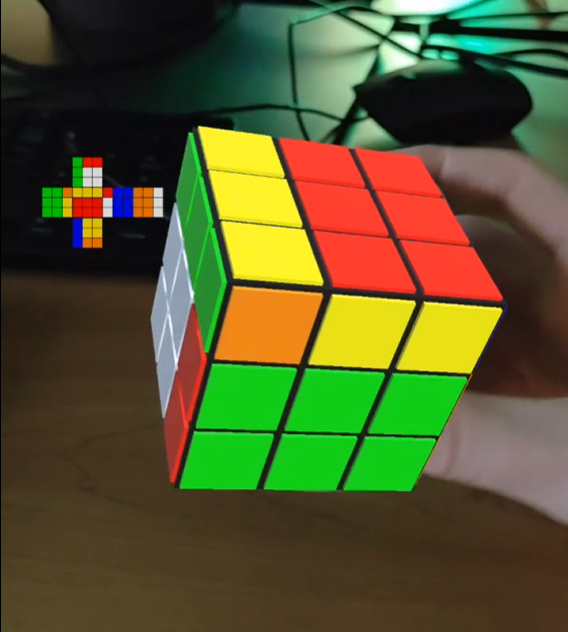
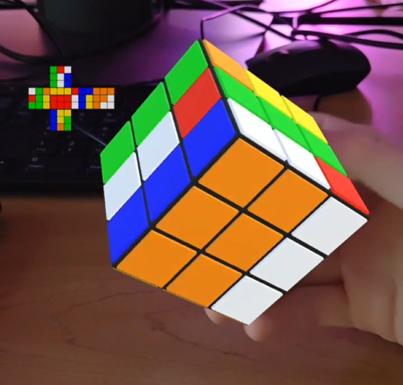

This project involved the use of unity as well as an augmented reality library, to place a 3d model of a Rubik's Cube onto a handheld cube. The handheld cube has printed patterns on each side that help the software map the Rubik's Cube onto the right area of the screen. The cube is fully functional and solveable, and movement of the cube is entirely controlled by your hand in the real world. Manipulating the Rubik's Cube's faces is as simple as swiping the cube on the screen.

After rotating a few faces and rotating the cube in my hand:

The cube maps best in high light conditions, but it follows your hand pretty accurately. For this to work, you do need to print out a special pattern onto the surface of a cube, to be recognized by the mapping software.

#### Project Demo

<video height="300px" src="../img/ar-rubiks-cube/demo-video-1.mp4" controls></video>

As you can see, the swiping system isn't fully fleshed out, but this can be redone, as the important thing is that the proper face is selected.
