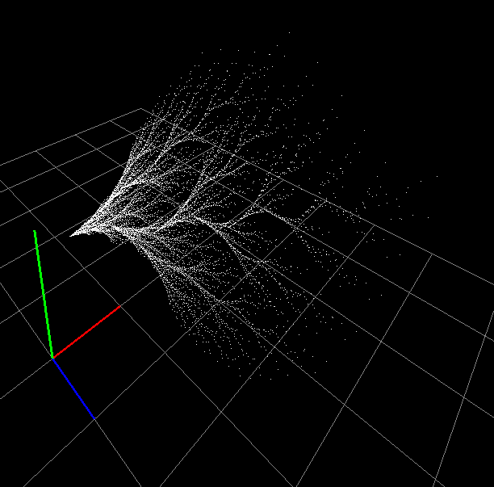
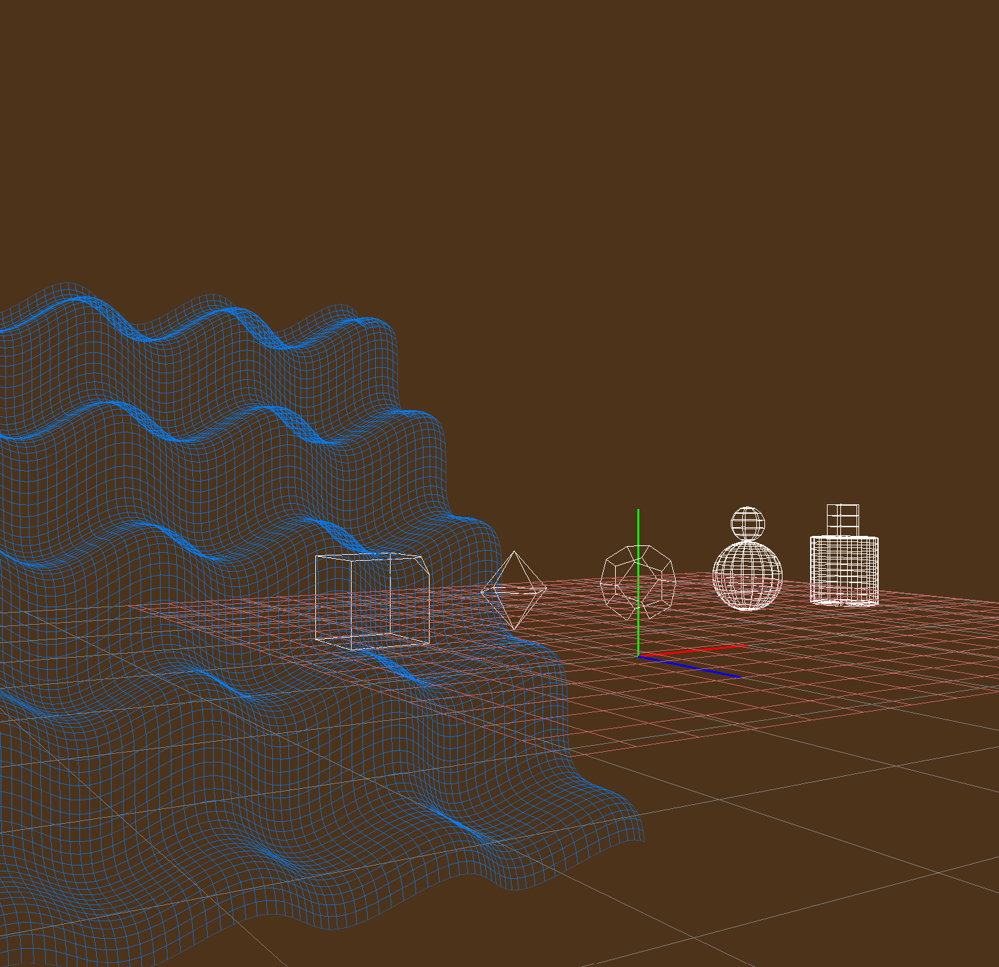
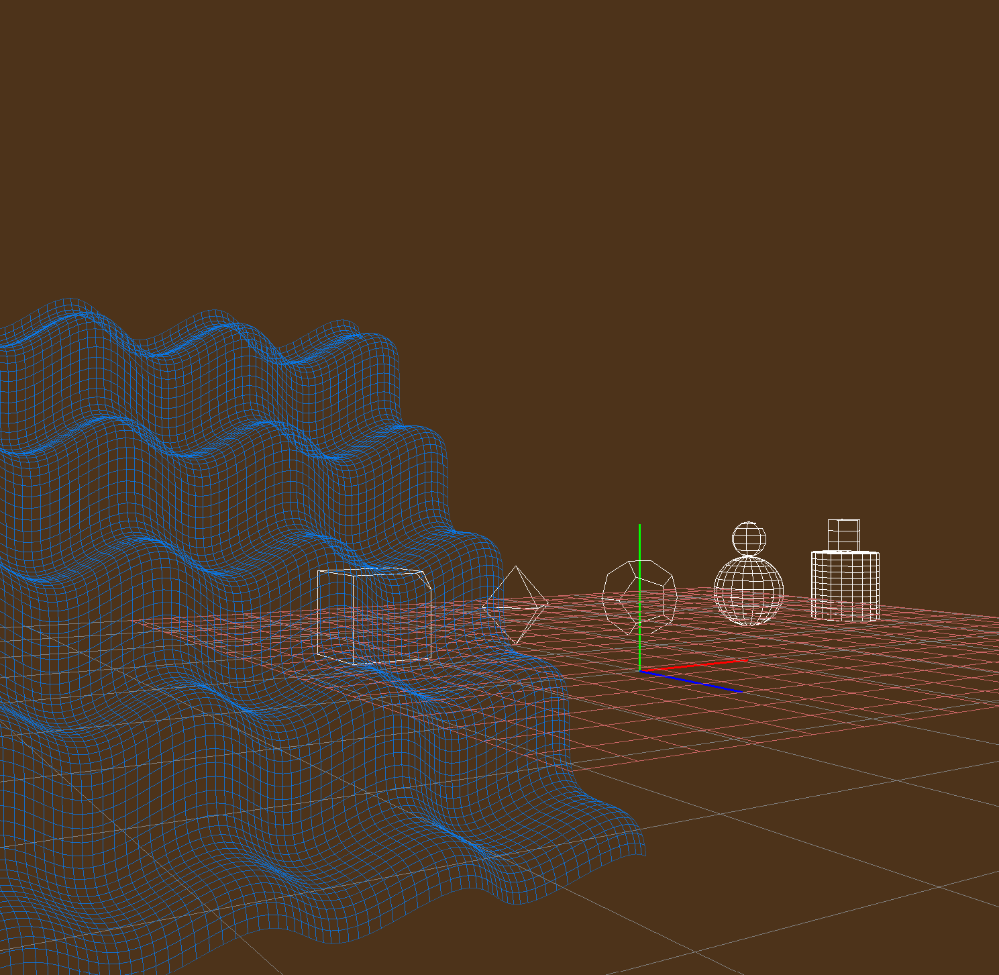
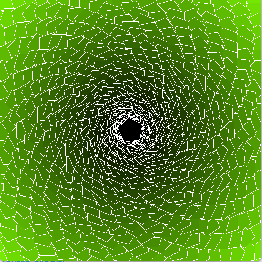

<video class="float-start" style="padding-right:20px; padding-bottom:10px;" src="../img/lisp-opengl-renderer/ICS481_HW5_bueche.mp4" width="500px" alt="Final-demo" controls></video>

This is my OpenGL renderer, built for a Computer Graphics class. In this demo, a man summons some kinda fractally magic thing, and throws it at another dude. This all runs in real time, and was recorded with OBS.

The scene features a procedural terrain with randomly sized and randomly placed trees. The trees exhibit smooth shading, while the people exhibit flat shading. The fractal is composed of a particle system using an iterated function system that operates on a list of transforms.

The people are composed of several meshes, offset to rotate around their ends, offset again to build the character. A collection of keyframeable joint transforms allow me to control what the body is doing throughout the whole animation. I simply push the timestamp onto a list, and then hash a copy of the object using the timestamp as a key.

The terrain is generated using a height field, with y values displaced by a bunch of random sine waves, and trees are placed on random points throughout the scene.

This renderer features:
- 2D and 3D capability
- Smooth and flat shading
- Flat coloring, or gradient coloring
- Point lights and directional lights
- Transforms
- Procedural polygons and polyhedrons
- Iterated function systems
- Keyframing transforms and colors
- Backface culling

I'm most proud of my fractal system, so I wanted to showcase a few videos of fractal interpolation.

In the following videos, I keyframe randomly generated fractal IFS's, and they bautifully transition into eachother. Initially, I accidentally fed my random rotations degrees instead of radians. But this error actually opened up the ability for much more chaotic and beautiful behavior.

  
    <video class="border" src="../img/lisp-opengl-renderer/Fractal-Interpolation-1.mp4" height="250px" alt="fractal vid 1" controls></video>
  
  
    <video class="border" src="../img/lisp-opengl-renderer/Fractal-Interpolation-1.mp4" height="250px" alt="fractal vid 2" controls></video>
  
  
    
  

 
Here's some polyhedrons rendered as wireframes, and then again with backface culling enabled:

  
    
  
  
    
  

And here's some 2D stuff, including my recreation of Geometry Dash:

  
    <video class="border" src="../img/lisp-opengl-renderer/ICS481_HW3_bueche.mp4" height="250px" alt="Pentagon Spiral" controls></video>
  
  
    
  

  Combining all of these things (except the 2D stuff) into one big animation resulted in the final animation at the top. I'm super proud of the work I did on this, and the things I've learned along the way.

# Final Thoughts

  If I were to expand this right now, I would want to:
  - Abstract things a bit more to tidy certain things.
  - Honestly not much more, I'd rather take the skills I learned here into new projects

  This renderer was for a class, but keyframes, interpolation, and fractals were all creative freedoms of mine. I really enjoyed figuring out how to implement those things, and I love the results that it gave. I plan to use the skills I learned here to implement some of these things in a more advanced renderer in the future.

