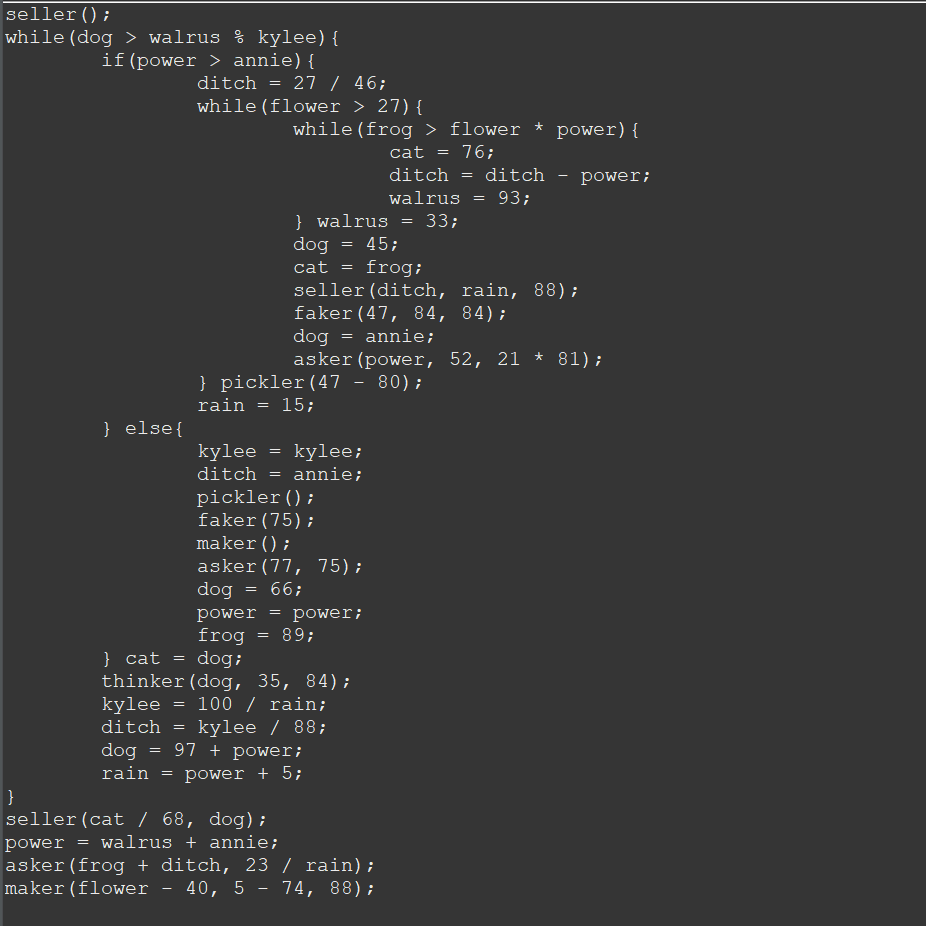

This project generated random code including method calls, conditionals, assignments, and while loops. It draws from an array of names, numbers, and operations which produces valid Java statements. Compound statements such as loops can cause the program to crash, as you can get a loop within a loop within a loop, and on and on, so there is a variable that limits the amount of compount statements that can be produced.

Here is an example output when the program is run, and the compound statement limiter is set to 5:                        

