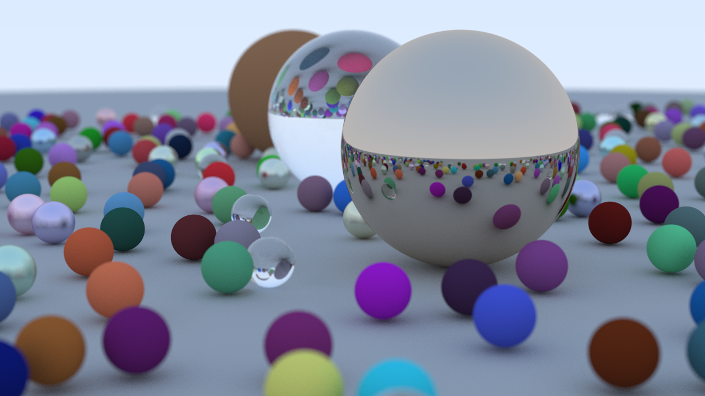
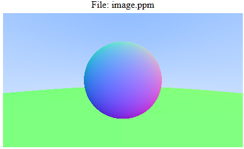
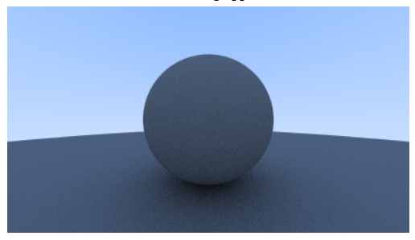
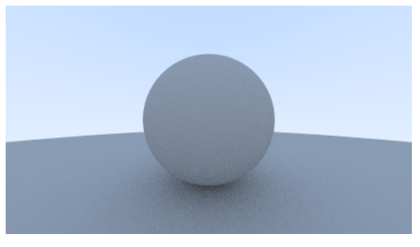
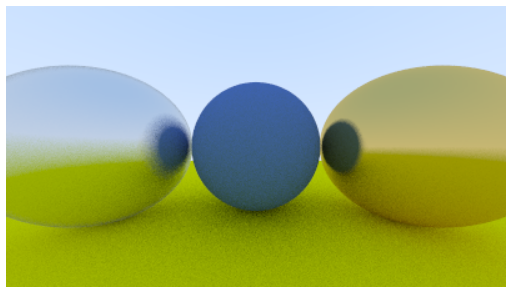
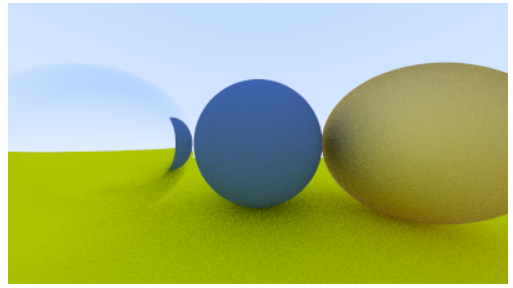
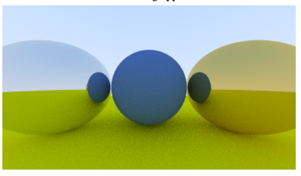
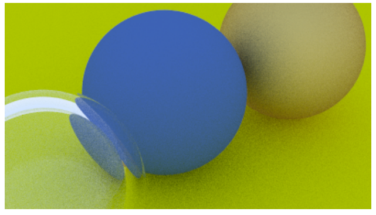
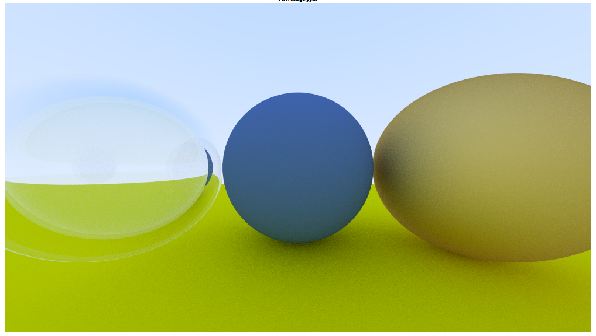
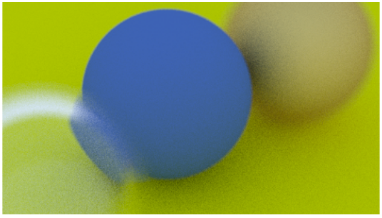

For round 2 of ray tracing, I chose to use C++. Boy did it streamline things. C is great, don't get me wrong, but it really helped me appreciate the simple abstractions that C++ can offer a ray tracing project. This time, I followed a book, and learned that every graphics engine is faced with fundemental design decisions. I made such decisions in my last ray tracer, aimlessly and for better or worse. The book has given me insights into what design paths are available, and the structure that a graphics engine can take.

This image follows the scene described in the last entry of the first book. It initially took 12 hours to render, but after implementing multi-threading, it went down to about an hour (I have a 12 core processor).

If you're interested in ray tracing, and don't know where to start, I heavily recommend checking out [Ray Tracing in One Weekend - The Book Series](https://raytracing.github.io/).

I wanted to leverage the GPU to make rendering even faster, but unfortunately, I decided that I should use Visual Studio for the first time ever for this project. OpenMP, the parallel processing library I was using, has the capability to offload work to the GPU as of version 4.0. Visual Studio supports OpenMP 2.0 built in. This was intended to be a quick project, so I wasn't going to go download a local version of OpenMP 4.0+ or any other libraries. Overall, I am satisfied with the 12x speedup.

This ray tracer features:
- Rough, glossy, specular, and dielectric (refractive) spheres.
- No lights as of yet. We kind of assume even lighting from a gradient skybox, and each ray bounce absorbs some light.
- Monte Carlo Integration of the hemisphere of incoming light.
- Depth of field, with a settable focus range and blurring level.
- Efficient multithreading, and a percent completion counter.
- Outputting images to a ppm file.

Here we have the initial surface-normal gradient shading, shown in the online ppm viewer as Windows does not have a way to view ppm image files. Followed by this, we have a diffusely shaded sphere, and then gamma correction for image files:

  
    
  
  
    
  
  
    
  

 
After the initial setup, I implemented the different reflection and refraction models:

  
    
  
  
    
  

And we can specify if we want reflection to be specular or glossy:

  
    
  
  
    
  

We can then use 2 refracting spheres to simulate a bubble, and even up the resolution and samples a little to get a nicer output:

  
    
  
  
    
  

And finally, let's set up our depth of field:

  

All of these things come together in our final image above, by just dumping a ton of random sphere positions and materials, and choosing a nice vantage point with a focal point on our main spheres.

# Final Thoughs

I loved doing this project, and I'll be revisiting it soon to expand it with the material from Ray Tracing: The Next Week. I learned a lot about graphics engine design, and I hope to flesh this engine out into an awesome personal renderer. One thing I want to do independently of the books is rendering to binary image formats, rendering videos with keyframes, and importing 3d objects. These things may require the use of additional libraries, but if possible I'd prefer to implement them myself.

This project was seriously so much fun, and digging deep into the math to answer why the authors did what they did was a great learning experience. I can't recommend it enough.
