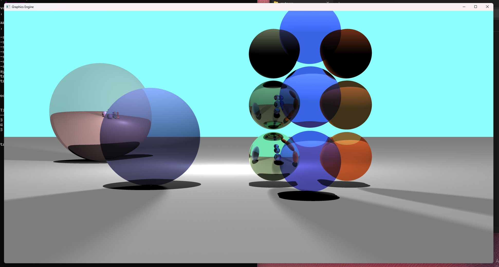
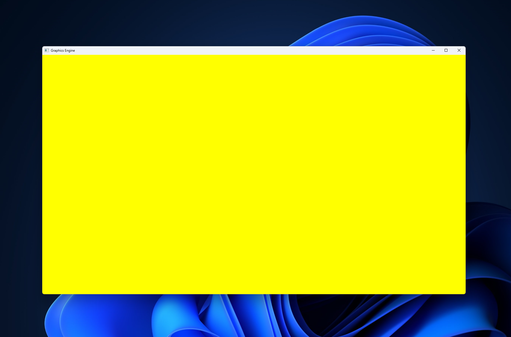
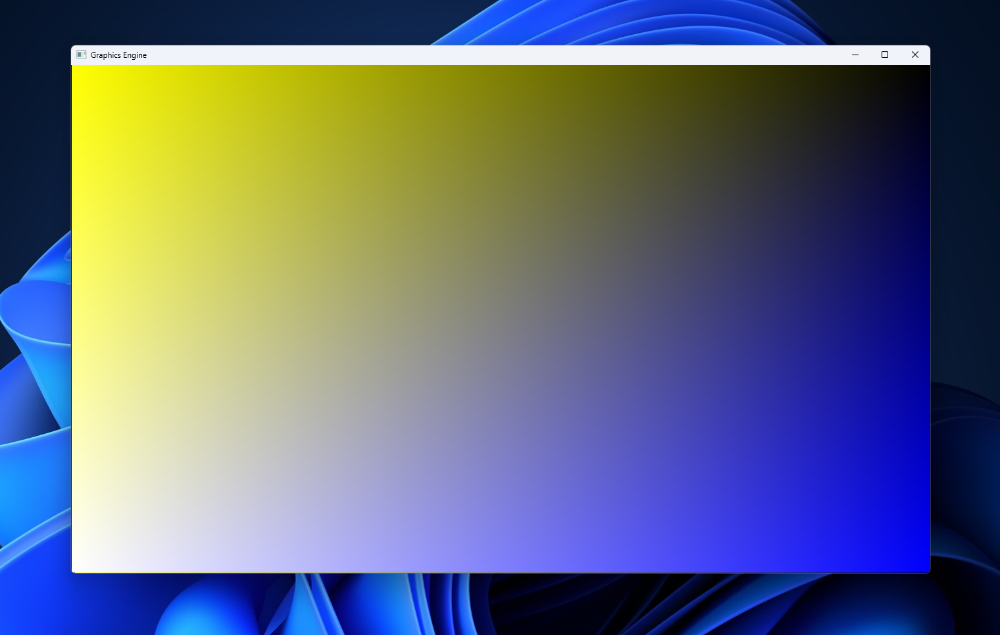
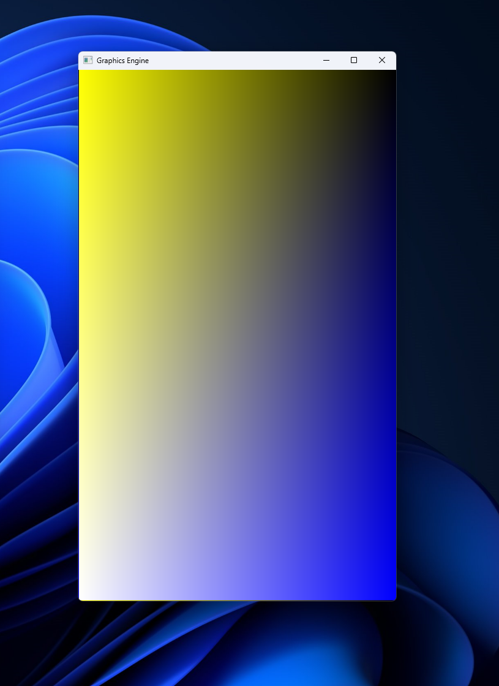

One day I woke up and decided that I wanted to build a ray tracer. I didn't know anything about how at the time, but I wanted to understand every part of it. I built this ray tracer from the ground up, in plain C, without the use of any unnecessary libraries. This project was not meant to be performant, but rather a learning experience. In order to achieve this, I implemented every function necessary from scratch. I worked out math problems for ray-plane and ray-sphere intersections, and learned how common code implementations are derived from these equations. This was a deep dive into the nitty gritty of what makes a ray tracer a ray tracer.

I seriously, seriously was so stubborn about not using any libraries throughout this project. For the longest time, I elected to not use math.h, the standard c math library. Instead, I wrote complex math functions myself. I might've had delusions of faster performance at the time, I don't know. Pro tip: Implementing a square root function is a fun little project, but it won't be as fast or accurate by a longshot. Standard libraries use built in CPU instructions for math where they can, which is multitudes faster. I had some crazy unique visual bugs that were solved by switching to math.h's sqrt function.

The only libraries 0used in this project are windows.h to open a window and draw to the screen, and math.h for some nice stress free maths. I did not use OpenGL or DirectX, everything is executed directly on the CPU. As you can imagine, this is quite slow, but at the time CPU logic was the most familiar and accessible to me, so I just did it.

#### Demo of All Current Features



This image is the culmination of months of work on this project. It took about 2 minutes to render. So without further ado, here's a full list of features I've implemented:
- Implicit spheres and planes
- Point lights, directional lights, and spherical lights
- Lambertian and specular reflection with an adjustable roughness
- Refraction with an adjustable refractive index
- Soft shadows when spherical lights are used
- Anti-Aliasing adjustable to any number of samples.

And here's a list of all the cool algorithms and data structures I implemented throughout this project:
- ObjectNode struct that lets me chain several types of objects into one linkedlist
 - This is basically like implementing objects in C. It was so tedious and I yearned for C++
- A whole freakin ton of vector math. Addition, subtraction, normalization, dot products, you name it
- Ray-plane intersection
- Ray-sphere intersection
- An algorithm that finds the closest object in a ray's path
- Sum of lambertians algorithm that calculates the light seen from all direct sources at a point.
- Reflection algorithm that takes a ray and a normal and outputs a reflection ray
- Refraction algorithm that takes a ray, a normal, and a refractive index, and outputs a refractive ray
- Trace Ray algorithm that finds the closest object a ray hits, determines its transparency and roughness, and recursively reflects and refracts rays until the limit is reached
- Camera rig that has a height, width, and depth, and accurately spaced pixels based on the current window size. It can shoot a bunch of evenly spaces rays per pixel and average them for Anti-Aliasing

I won't be going too much into the nitty gritty details of building this thing here, but I implemented every feature by braining it out. I was obsessing over doing it from scratch, and that taught me a lot. I relied on sources for vector math, but I did a deep dive to answer for myself how the math was derived in each case.

#### First Attempt

During my first attempt at this project, I was researching the math behind ray tracers. I wanted to write everything myself, and I was working in one file. Quickly things began to get messy.

I decided to forego all the vector math, in an effort to just have a color appear on the screen. Nothing showed up, but I had successfully opened a window!

#### Square One

At this point, I decided to just restart. I created a new file main.c where I opened the window, and created the gameloop.

The process of opening a window in c with no libraries is a bit complicated, but it boils down to creating a window "class" (not an object-oriented-programming class), registering the class, creating the window, and showing the window.

The reason we do this is that Windows needs to build a bridge between your code and their built in window interface. The code is a little long and hard to make sense of from a glance, so I won't be showing it here.

The window making process also requires us to create a function that handles each of its cases, and sends the unhandled ones to the default handler. One of these cases is WM_PAINT, which allows us to paint the screen. My code for that segment looks like this:

```c
case WM_PAINT:
{
    static PAINTSTRUCT paint;
    static HDC device_context;
    device_context = BeginPaint(window_handle, &paint);
    BitBlt(device_context,
           paint.rcPaint.left, paint.rcPaint.top,
           paint.rcPaint.right - paint.rcPaint.left,
           paint.rcPaint.bottom - paint.rcPaint.top,
           frame_device_context,
           paint.rcPaint.left, paint.rcPaint.top,
           SRCCOPY);
    EndPaint(window_handle, &paint);
}
break;
```

This code looks at frame_device_context which contains the pixel array that we copy over to the screen.

```c
while (!quit)
{
    static MSG message = { 0 };
    while (PeekMessage(&message, NULL, 0, 0, PM_REMOVE))
    {
        TranslateMessage(&message);
        DispatchMessage(&message);
    }
    /* This is where we do everything for the game. */
    for (x = 0; x < pixelGrid.width; x++)
    {
        for (y = 0; y < pixelGrid.height; y++)
        {
            pixelGrid.pixels[(y * pixelGrid.width + x)] = 0x00ffff00;
        }
    }
    InvalidateRect(window_handle, NULL, FALSE);
    UpdateWindow(window_handle);
}
```

pixelGrid.pixels is a pointer to our pixel grid. In the first part of our loop, we handle messages such as window resizing or painting to the screen. Then, we set the rgb values as such: 0x00RRGGBB. At the end of our loop, we invalidate the entire window screen so that it has to be redrawn, and then we update the window. At the start of the loop, the WM_DRAW message will be dispatched to our handler function, which will copy everything from our array to the screen. 0x00ffff00 is the hexadecimal for yellow in 24-bit color. Voila! A yellow screen!



The nice thing about this is that we are constantly setting resetting each pixel as fast as we can, so we essentially have a realtime renderer. Let's change the color line to the following:

```c
pixelGrid.pixels[(y * pixelGrid.width + x)] = 0x00010100 * (int) (256 * (pixelGrid.width - x) / pixelGrid.width)
                                            + 0x00000001 * (int) (256 * (pixelGrid.height - y) / pixelGrid.height);
```

Now we have the following gradient:



And if we resize it:



Huzzah!

From this point, I did the following:
1. Create a vector from the origin of the camera, in the direction of a pixel on the screen.
2. Use a function to check whether a ray following this vector will intersect a plane or sphere.
3. Find the closest thing which is intersected.
4. Set the pixel's color to the color of the thing.
5. Repeat this process for every pixel.
6. Add multisampling

The first step in this process is vector math:

```c
inline vector3d v3dAdd(vector3d a, vector3d b)
{
    rerun { (a.x + b.x), (a.y + b.y), (a.z + b.z) };
}

inline vector3d v3dSubtract(vector3d a, vector3d b);
{
    return { (a.x - b.x), (a.y - b.y), (a.z - b.z) };
}

inline vector3d v3dMultiply(vector3d a, double b);
{
    return { (a.x * b), (a.y * b), (a.z * b) };
}

inline vector3d v3dDivide(vector3d a, double b);
{
    return { (a.x / b), (a.y / b), (a.z / b) };
}

inline double v3dLengthSqr(vector3d a)
{
    return sqr(a.x) + sqr(a.y) + sqr(a.z);
}

inline double v3dLength(vector3d a);
{
    return sqrt(v3dLengthSqr(a));
}

inline double v3dNormalized(vector3d *a);
{
    double x = v3dLength(*a)
    v3dDivide(a, v3dLength(a));
    return x;
}
```

I wasn't sure if I wanted to change the original vectors' values using pointers, or if I want to return a new vector every time. I'm also not fully sure how inline functions work with memory management on the stack, but the idea is to reduce function call overhead since these functions will be called many many many times per second. I based my inlining off of a C++ example, and assumed that it was the same functionality, but I don't think it's doing what I thought it was.

After that, I wrote some math functions (yes, writing sqrt was silly, I was obsessed with doing it from scratch):

```c
inline double sqr(double x)
{
    return x * x;
}

inline double sqrt(double x)
{
    double epsilon = 0.000001;
    double guess = x / 2.0;
    while ((guess * guess - x) > epsilon || (x - guess * guess) > epsilon)
    {
        guess = (guess + (x / guess)) / 2.0;
    }
    return guess;
}
```

The sqrt method is based on Newton's method for calculating a square root. Another idea is to treat the range from 0 to x as a binary search range, and then checking if (0 + x)/2 squared is less than, greater than, or equal to the square root. In practice, however, this has the same runtime as Newton's algorithm, and Newton's algorithm takes less iterations on average.

News flash: The CPU has hardware instructions that does it way faster, and the standard library takes advantage of this. Also this was causing WEIRD artifacts later on, so I eventually caved to using the standard math library.

I then implemented dot products, and all the other things I mentioned above, and I don't quite have to time to detail the process right now, but you can check out the code on my GitHub if you want!

#### Additional Notes

The finished product is not very efficient, as every operation defined by me is happening on the cpu. Despite this, my goal is to understand how a ray tracer works behind the scenes. I'll eventually take a stab at using a graphics API like DirectX to do the same thing more efficiently (and probably more elegantly).
