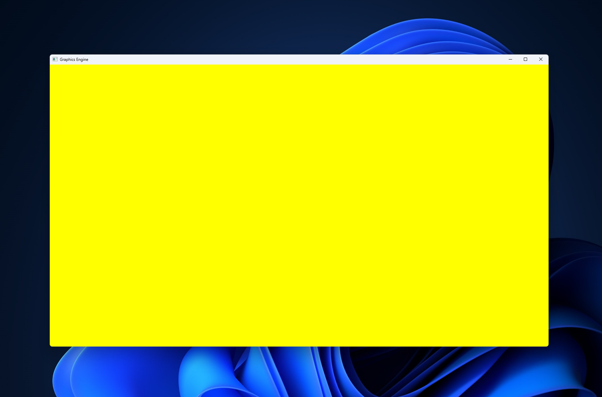
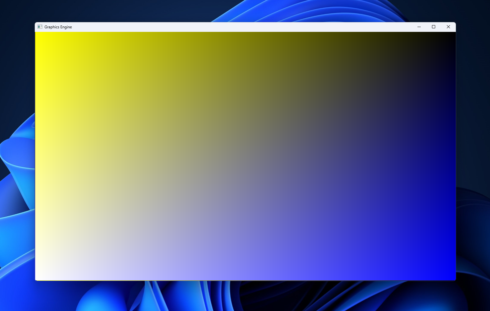
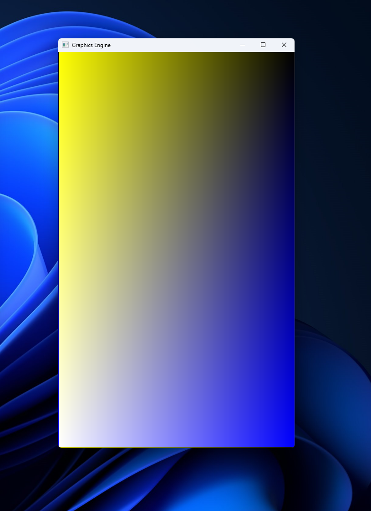

First things first, this project is incomplete. The good news? Heres a yellow screen!




#### First Attempt

During my first attempt at this project, I was researching the math behind ray tracers. I wanted to write everything myself, and I was working in one file. Quickly things began to get messy.

I decided to forego all the vector math, in an effort to just have a color appear on the screen. Nothing showed up, but I had successfully opened a window!

#### Square One

At this point, I decided to just restart. I created a new file main.c where I opened the window, and created the gameloop.

The process of opening a window in c with no libraries is a bit complicated, but it boils down to creating a window "class" (not an object-oriented-programming class), registering the class, creating the window, and showing the window.

The reason we do this is that Windows needs to build a bridge between your code and their built in window interface. The code is a little long and hard to make sense of from a glance, so I won't be showing it here.

The window making process also requires us to create a function that handles each of its cases, and sends the unhandled ones to the default handler. One of these cases is WM_PAINT, which allows us to paint the screen. My code for that segment looks like this:

```c
case WM_PAINT:
{
    static PAINTSTRUCT paint;
    static HDC device_context;
    device_context = BeginPaint(window_handle, &paint);
    BitBlt(device_context,
           paint.rcPaint.left, paint.rcPaint.top,
           paint.rcPaint.right - paint.rcPaint.left,
           paint.rcPaint.bottom - paint.rcPaint.top,
           frame_device_context,
           paint.rcPaint.left, paint.rcPaint.top,
           SRCCOPY);
    EndPaint(window_handle, &paint);
}
break;
```

This code looks at frame_device_context which contains the pixel array that we copy over to the screen.

```c
while (!quit)
{
    static MSG message = { 0 };
    while (PeekMessage(&message, NULL, 0, 0, PM_REMOVE))
    {
        TranslateMessage(&message);
        DispatchMessage(&message);
    }
    /* This is where we do everything for the game. */
    for (x = 0; x < pixelGrid.width; x++)
    {
        for (y = 0; y < pixelGrid.height; y++)
        {
            pixelGrid.pixels[(y * pixelGrid.width + x)] = 0x00ffff00;
        }
    }
    InvalidateRect(window_handle, NULL, FALSE);
    UpdateWindow(window_handle);
}
```

pixelGrid.pixels is a pointer to our pixel grid. In the first part of our loop, we handle messages such as window resizing or painting to the screen. Then, we set the rgb values as such: 0x00RRGGBB. At the end of our loop, we invalidate the entire window screen so that it has to be redrawn, and then we update the window. At the start of the loop, the WM_DRAW message will be dispatched to our handler function, which will copy everything from our array to the screen. 0x00ffff00 is the hexadecimal for yellow in 24-bit color. This is how we get our yellow screen above.

The nice thing about this is that we are constantly setting resetting each pixel as fast as we can, so we essentially have a realtime renderer. Let's change the color line to the following:

```c
pixelGrid.pixels[(y * pixelGrid.width + x)] = 0x00010100 * (int) (256 * (pixelGrid.width - x) / pixelGrid.width)
                                            + 0x00000001 * (int) (256 * (pixelGrid.height - y) / pixelGrid.height);
```

Now we have the following gradient:




And if we resize it:




#### Ray Tracing!

So, as you may know, this project is currently incomplete. I didn't want to rely on any libraries, and this means implementing a bunch of math and vector math functions.

Heres an outline for what I plan to do:
1. Create a vector from the origin of the camera, in the direction of a pixel on the screen.
2. Use a function to check whether a ray following this vector will intersect a plane defined by a triangle.
3. Find the closest triangle which is intersected.
4. Set the pixel's color to the color of the triangle.
5. Repeat this process for every pixel.

The first step in this process is vector math, which I've started to implement:

```c
inline vector3d v3dAdd(vector3d a, vector3d b)
{
    rerun { (a.x + b.x), (a.y + b.y), (a.z + b.z) };
}

inline vector3d v3dSubtract(vector3d a, vector3d b);
{
    return { (a.x - b.x), (a.y - b.y), (a.z - b.z) };
}

inline vector3d v3dMultiply(vector3d a, double b);
{
    return { (a.x * b), (a.y * b), (a.z * b) };
}

inline vector3d v3dDivide(vector3d a, double b);
{
    return { (a.x / b), (a.y / b), (a.z / b) };
}

inline double v3dLengthSqr(vector3d a)
{
    return sqr(a.x) + sqr(a.y) + sqr(a.z);
}

inline double v3dLength(vector3d a);
{
    return sqrt(v3dLengthSqr(a));
}

inline double v3dNormalized(vector3d *a);
{
    double x = v3dLength(*a)
    v3dDivide(a, v3dLength(a));
    return x;
}
```

These functions haven't been tested yet, and I'm not sure if I want to change the original vectors' values using pointers, or if I want to return a new vector every time. I'm also not fully sure how inline functions work with memory management on the stack, but the idea is to reduce function call overhead since these functions will be called many many many times per second.

Some of these functions rely on these basic math functions I've written:

```c
inline double sqr(double x)
{
    return x * x;
}

inline double sqrt(double x)
{
    double epsilon = 0.000001;
    double guess = x / 2.0;
    while ((guess * guess - x) > epsilon || (x - guess * guess) > epsilon)
    {
        guess = (guess + (x / guess)) / 2.0;
    }
    return guess;
}
```

The sqrt method is based on Newton's method for calculating a square root. Another idea is to treat the range from 0 to x as a binary search range, and then checking if (0 + x)/2 squared is less than, greater than, or equal to the square root. In practice, however, this has the same runtime as Newton's algorithm, and Newton's algorithm takes less iterations on average.

Eventually, when I've implemented dot products and cross products and the line-plant-intersection-checker, I'll try drawing a basic triangle in 3d space.

#### Additional Notes

The finished product is not going to be very efficient, as every operation defined by me is happening on the cpu. Despite this, my goal is to understand how a ray tracer works behind the scenes. Once I've finished this project, I'll take a stab at using a graphics API like DirectX to do the same thing more efficiently (and probably more elegantly).
