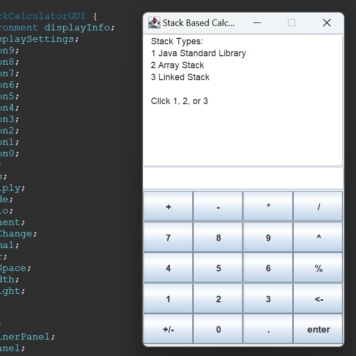

This project is a postfix calculator with a Graphical User Interface (GUI). On startup, the calculator lets you choose between 3 different types of stacks to implement. The first is Java's pre-defined stack from its own library, the second is an array stack with a limited amount of storage, and the third is a linked stack which implements linked lists. The GUIis implemented using Java Swing, and allows users to 'build' numbers with the calculator's buttons before adding them to the stack. Users can add and remove digits from 0-9, as well as a maximum of one decimal, and there's a single button to change the positive sign to a negative sign and vice versa.

A postfix calculator is a calculator that requires 2 number values before it accepts an operator. If you enter 5, and then 3, and then the subtraction operator, the calculator reads it as 5 - 3, which is 2. The values 5 and 3 are removed from the calculator's memory, and value 2 is added. Note that you can add as many values as you want, but the last 2 values you added will be used for whatever operation you choose, and will then be replaced with the result. 3 2 5 * - is read as 2 * 5 - 3.

Throughout this project I gained a lot of insight into graphical user interfaces, and the different ways number input systems can be handled. My calculator uses the Java Swing library to create a fixed-size window which is a certain fraction of the default display's size. Then a text window, scroll pane, and buttons are added. Creating a GUI for the first time requires a lot of messing around and looking through documentation. In the future, I would prefer to use a library that gives more control over what buttons and windows look like, but I appreciate Swing for not being too complicated. 'Building' numbers was a challenge. I decided to add the first number, multiply it by ten, add the next number, and repeat until you add the last number. The difficulty lied in building decimals, and I had to run a second loop to solve that.

[Here's](https://github.com/kylebueche/StackCalculatorWithGUI) the source code for my project, and here's what the calculator looks like:                                  

