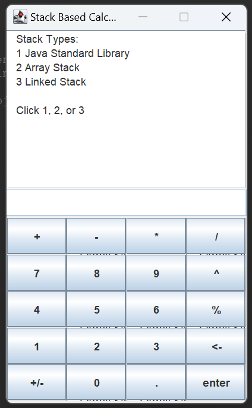

This project is a postfix calculator with a graphical user interface. On startup, the calculator lets you choose between 3 different types of stacks to implement. The first is Java's pre-defined stack from its own library, the second is an array stack with a limited amount of storage, and the third is a linked stack which implements linked lists.

My graphical user interface allows users to 'build' numbers before adding them to the stack. Users can add and remove digits and a decimal, and theres a single button to change the positive sign to a negative sign.

A postfix calculator is a calculator that requires 2 number values before it accepts an operator. If you enter 5, and then 3, and then the subtraction operator, the calculator reads it as 5 - 3, which is 2. The values 5 and 3 are removed from the calculator's memory, and value 2 is added. Note that you can add as many values as you want, but the last 2 values you added will be used for whatever operation you choose, and will then be replaced with the result. 3 2 5 * - is read as 2 * 5 - 3.
