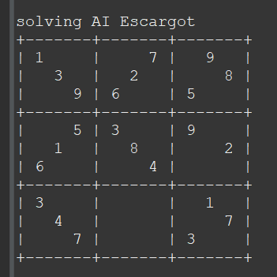

This project is a program that can solve any solvable sudoku problem through recursion. I completed this project in my 1st year at UH Manoa, in my ICS 211 course. I learned a lot about brute forcing solutions and proper recursion throughout this project.

This program chooses a legal answer for each open square from left to right, top to bottom. It does this until there are no more legal options in a given square, at this point it backtracks and tries the next legal option for a previous square. This repeats until the sudoku is solved or is deemed unsolvable.

Here is my program's solution for the famous 'AI Escargot' sudoku problem:                          

